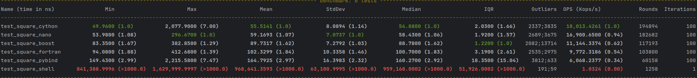

# Python Wrapping

## Installation

*Install Miniforge*: [https://github.com/conda-forge/miniforge](https://github.com/conda-forge/miniforge)

Follow installation instructions. Use default installation settings.

### Create an environment
```bash
mamba create -n wrapping python boost
mamba activate wrapping
```
Now you can install the individual projects with the `install.sh` script.

For example, you can use the following command to install all modules and run the test suite:
```bash
./install.sh && pytest
```

## Results

